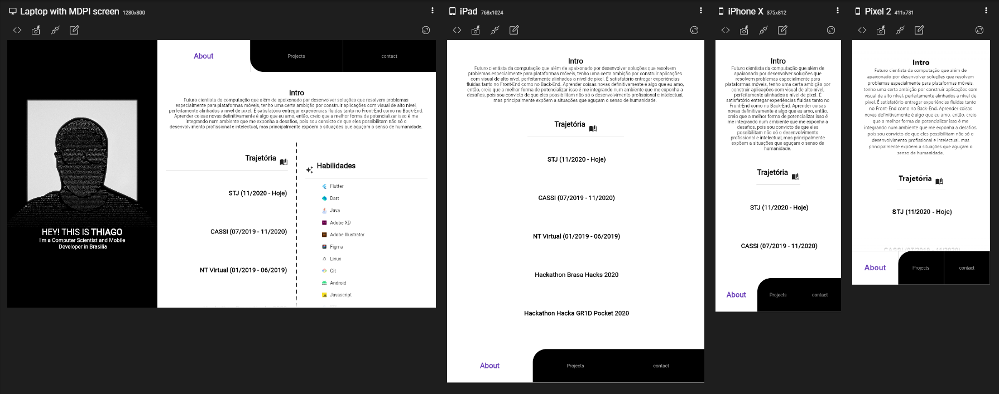
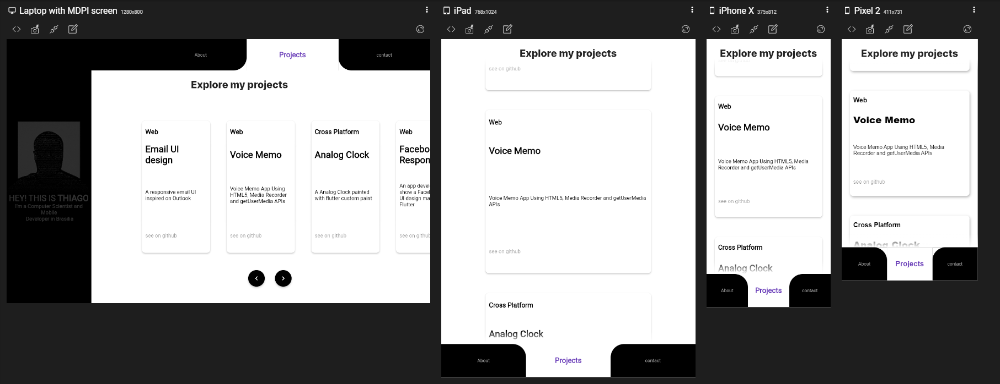

# Payflow

A personal showcase app developed with Flutter framework .

## Features in this project

 - [x] Reactive Animations
 - [x] Mouse events
 - [x] State management with provider
 - [x] Custom Animated AppBar

## Project Screen Shots

| Project Preview                             |
| ------------------------------------------- |
|  |

| About multi screen preview                           |
| ---------------------------------------------------- |
|  |

| Home multi screen preview                               |
| ------------------------------------------------------- |
|  |

## Installation and Setup Instructions

Clone down this repository. You will need `Flutter` and `Dart` installed globally on your machine.

Installation:

`flutter pub get install` on the project root.

To Run the android application:

`flutter run -d <device or emulator id>`

To build a android release:

`flutter build apk` the package will be generated on **./build/app/outputs/flutter-apk/app-release.apk**

